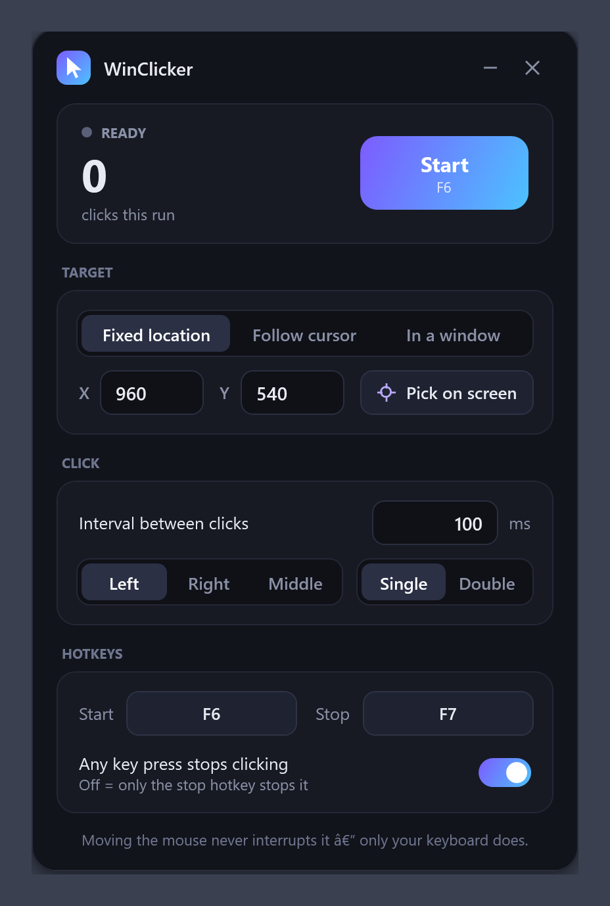
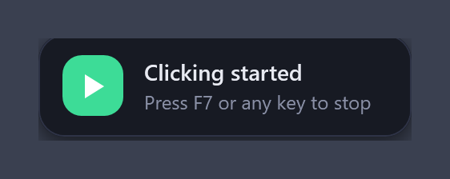

# WinClicker — Free Auto Clicker for Windows

**WinClicker is a free, open-source auto clicker for Windows 10 and 11.** It's a single 60 KB `.exe` with no installer, no ads and no dependencies — and unlike most auto clickers it can **click in the background inside a specific window** (a Chrome tab, a game, a form) while you keep using your mouse and keyboard for everything else.

[**⬇ Download WinClicker.exe**](../../releases/latest) · [Website](https://priyanshugetrekt.github.io/WinClicker/) · [Report a bug](../../issues)

## Features

- **Background auto clicking in any window.** Pick a spot inside a window and WinClicker posts the clicks straight to it. Your real mouse pointer never moves, so you can browse, type and work in other apps at the same time. The target window can sit behind other windows (just not minimized).
- **Clicks a fixed screen location or follows your cursor** — the classic auto clicker modes, with an on-screen picker to choose the exact pixel.
- **Only your keyboard stops it.** Moving the mouse never interrupts a run. Press your stop hotkey — or, optionally, *any* key — and it stops instantly.
- **Custom global hotkeys** to start and stop (default **F6** / **F7**). Click a hotkey button, press the key you want, including Ctrl / Alt / Shift combinations. The hotkeys are swallowed so the app you're clicking in never sees them.
- **Adjustable click interval** from 1 ms upward, with a dedicated high-resolution timing thread — thousands of clicks per minute if you want them.
- **Left, right or middle button; single or double click.**
- **Start/stop popup notifications** with the click count and run time, so you always know what it's doing.
- **Beautiful dark UI** — frameless, rounded, DPI-aware on every monitor.
- **Portable and tiny.** One `.exe`, no installer, no runtime to download. Settings live in `%APPDATA%\WinClicker\settings.ini`.
- **Open source (MIT)** — the entire app is one C# file and two XAML files.

## Download and install

1. Download `WinClicker.exe` from the [latest release](../../releases/latest).
2. Run it. There's nothing to install.

Windows SmartScreen may warn about an unknown publisher the first time, because the exe isn't code-signed. Click *More info → Run anyway*. You can also build it yourself from source in a few seconds (below) if you'd rather not run a downloaded binary.

**Build from source:** clone the repo and run `build.bat`. It uses `csc.exe` from the .NET Framework that's already on every Windows 10/11 machine — no Visual Studio needed.

## How to use WinClicker

| Target mode | What happens | Stops on |
|---|---|---|
| **Fixed location** | Moves the pointer to X/Y and clicks there. Choose the spot with *Pick on screen*. | Stop hotkey, or any key (switchable) |
| **Follow cursor** | Clicks wherever your pointer currently is. | Stop hotkey, or any key (switchable) |
| **In a window** | Sends clicks directly to one window, mouse-free. The window may be behind others, but not minimized. | Stop hotkey only — your typing goes to your other apps |

1. Choose a target mode and (for the first and third) click **Pick on screen** to choose the exact spot.
2. Set the interval in milliseconds, the mouse button and single/double click.
3. Press **F6** (or your own hotkey) to start, **F7** to stop. A popup confirms each.

## FAQ

**Does WinClicker work in the background / while I use other apps?**
Yes — that's the main reason it exists. Use the *In a window* mode. Clicks are delivered to that window directly, so your mouse and keyboard stay free for everything else.

**Does it work with Chrome, browser games and web pages?**
Yes. Background mode is verified against Google Chrome: with the Chrome window covered by another app, 25 posted clicks were all received by the page.

**Does it work for Roblox, Minecraft and other games?**
Fixed-location and follow-cursor modes work with any game, since they use the same input path as a real mouse. Background mode works with games that accept standard window mouse messages; some games that read raw hardware input ignore synthetic clicks — use Fixed location for those.

**Can I set the click speed / clicks per second?**
Yes. The interval is in milliseconds, minimum 1 ms (up to ~1000 clicks per second). 100 ms = 10 CPS.

**How do I stop it?**
Press the stop hotkey (default F7). In Fixed and Follow-cursor modes you can also turn on *Any key press stops clicking*. Moving the mouse never stops it.

**Is it safe? Is it a virus?**
It's open source — read [App.cs](App.cs), it's one file — and you can compile it yourself with `build.bat`. The SmartScreen warning only means the exe isn't code-signed.

**Does it need admin rights?**
No. But apps that run as administrator ignore clicks from a non-elevated WinClicker; run WinClicker as administrator too in that case.

**Does it work on Windows 10 and Windows 11?**
Yes, both, 64-bit. It needs .NET Framework 4.8, which ships with Windows 10 (1903+) and Windows 11.

## How it works

- Fixed and cursor modes use `SendInput`, the same path real hardware takes.
- Window mode walks the target's child windows (`ChildWindowFromPointEx`) and posts `WM_MOUSEMOVE` + `WM_xBUTTONDOWN/UP` with `PostMessage`, so it never blocks on a busy target.
- Hotkeys and "any key stops it" come from a low-level keyboard hook (`WH_KEYBOARD_LL`); auto-repeat is filtered so a held key counts once.
- Timing uses a 1 ms multimedia timer period and a stopwatch-scheduled loop on its own thread, so UI work never delays a click.

## License

[MIT](LICENSE). Free for personal and commercial use.

---

*Keywords: auto clicker, autoclicker, Windows auto clicker, free auto clicker, background auto clicker, auto clicker that works in background, auto clicker with hotkeys, mouse clicker, click automation, GS Auto Clicker alternative, OP Auto Clicker alternative, open source auto clicker.*
